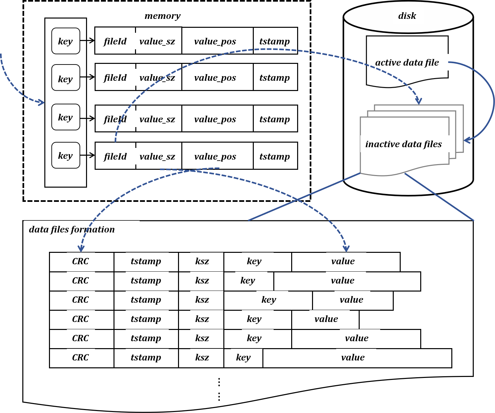
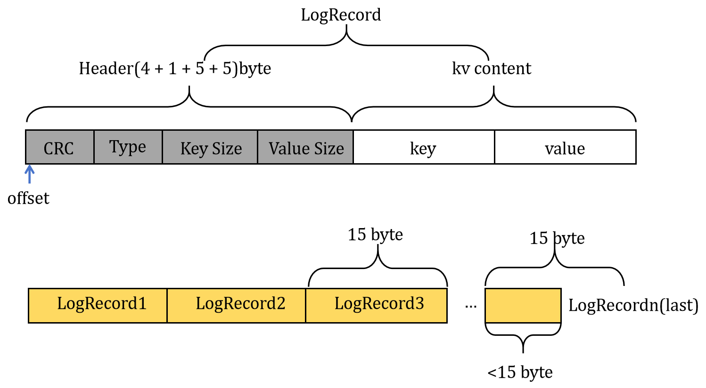
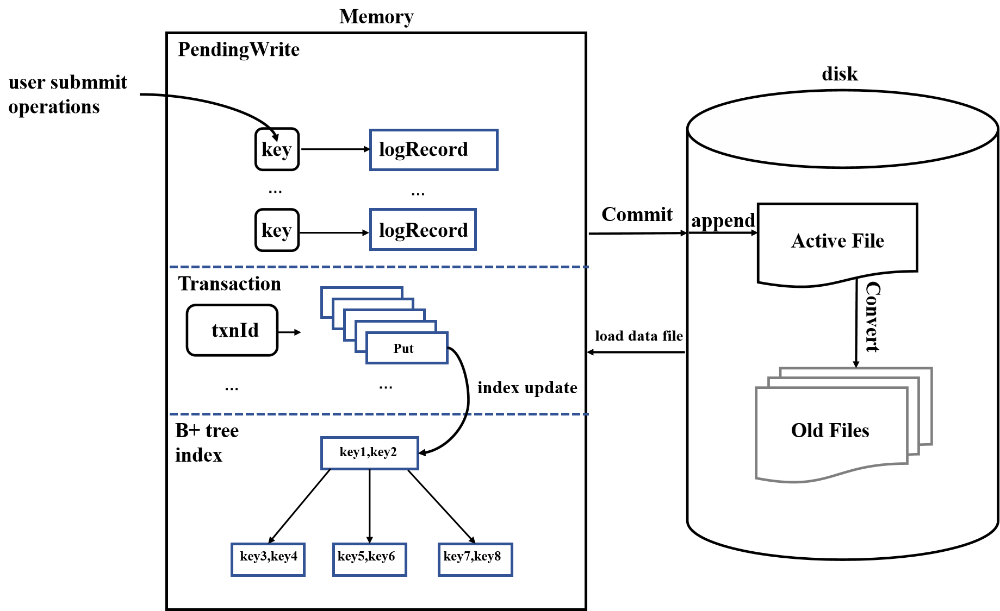
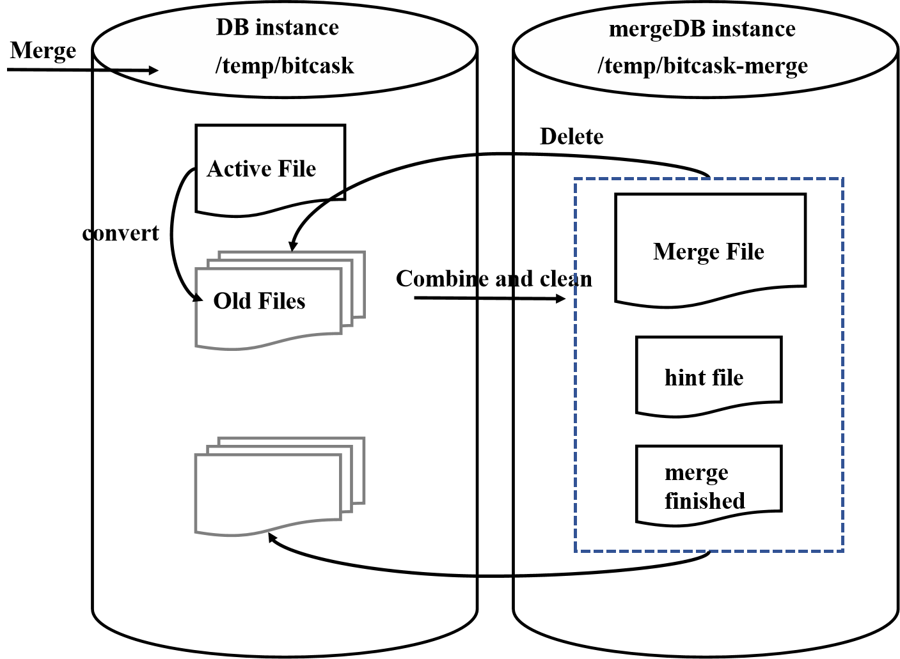
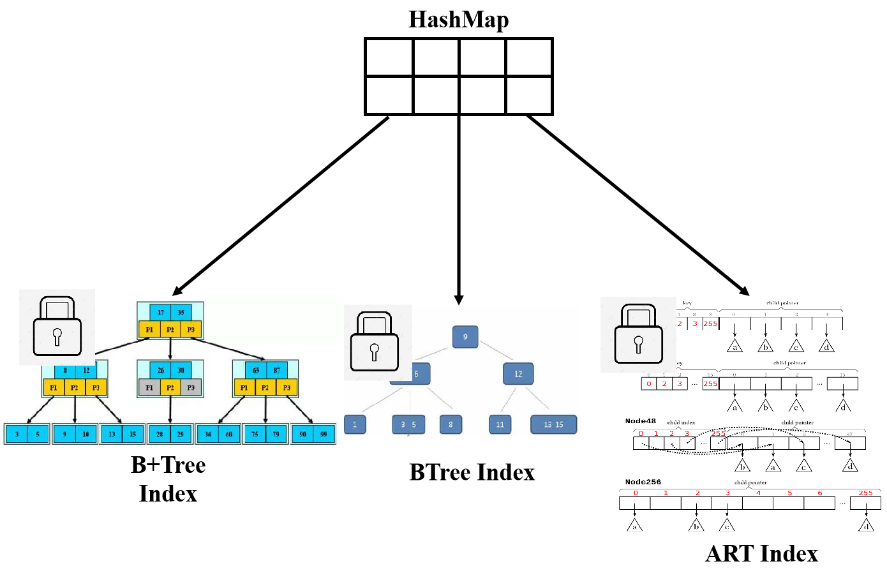
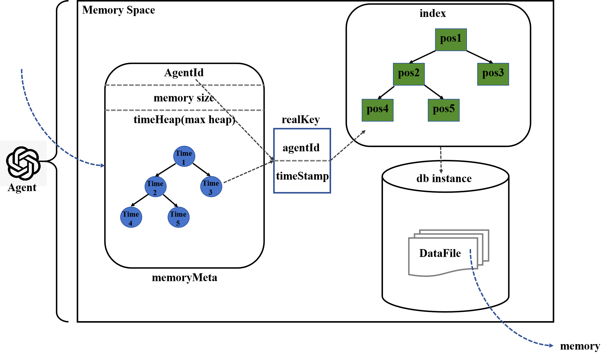
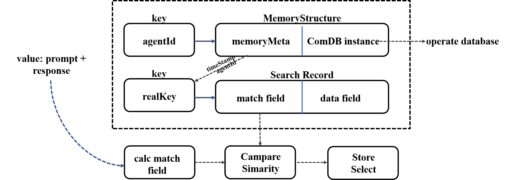

# 云原生架构下多智能体协作框架以及多智能体运维原型设计

---

## 项目目标

- 缩小平台工程师与开发人员的鸿沟，能够让开发工程师通过自然语言部署与运维应用，可以直接利用云原生集群的能力。
- 帮助运维工程师快速完成较为复杂任务的部署。比如mysql等，提高云原生工程师的工作便捷与效率
- 可以通过webhook监控集群数据，对于一些崩溃的应用，智能体能够读取日志内容并尝试修复较为简单的问题，提高应用的可恢复性。而不只是按照k8s的策略不断对应用进行重启
- 本系统暂时的设计受众是小型的开发团队对于大型团队功能需要进一步加强
- 对未来的期待：时候可以让agent系统控制一个数据中心从而打通软件工程从需求分析=> 资源部署 => coding => 应用部署 => 后期维护的全流程？从而实现软件开发完全由多智能体系统取代？权当(｡･∀･)ﾉﾞ自嗨

---

## 项目阶段

1. **专用于记忆存储的基于bitcask数据模型的kv数据库内核开发**

2. **针对运维/复杂环境下的多智能体框架探索**
3. **在云原生下的多智能体协作架构与框架适配**
4. **多智能体运维系统的搭建**
5. **云原生环境下的部署简化以及集群K8S兼容**

---

## 第一阶段:基于bitcask的NoSql数据库内核—ComDB

### 概述

​	ComDB是为了适配多智能体的记忆存储与搜索而开发的，基于bitcask数据模型的KV数据引擎。bitcask论文地址：[bitcask-intro.pdf](https://riak.com/assets/bitcask-intro.pdf)

常见的kv存储引擎有B+ 树，LSM树等。B+树的常见代表BoltDB，而LSM树则有著名的levelDB还有RocksDB。本数据库的常见操作是完全按照bitcask论文进行复现的并且为了适应智能体的搜索功能，我在数据库系统层集成了搜索的功能以支持智能体高效搜索记忆空间。

​	数据库需要支持：

* 读写低延迟
* 在面对大量随机写入的高吞吐量
* 能够处理超过内存容量的数据
* 可以保证快速恢复并且具备备份功能
* 能够具备高效的搜索功能

---


### 数据模型详述

​	bitcask的数据模型相比与LSM tree和B + tree是非常简洁易懂的。



bitcask架构如上图：

* 内存索引：数据库首先需要在内存中维护一个key的索引表（**keydir**），这个地方的做法其实是参照inode这个结构进行设计，思维是比较像的，每一个key都会维护一个对应的数据项，数据项的内容包括文件ID，value的偏移（size），value在files中的位置，时间戳。数据库进程通过fileId（文件名）去找对应的数据文件。
* 磁盘设计：bitcask实例的本质其实就是文件系统上的一个目录。我们将在目录中的数据文件分为了两类：活跃数据文件和非活跃数据文件。我们限制每次**只有一个进程**能进入目录（锁），写操作只能在活跃进程上进行，这保证了IO是**顺序执行**的，而不会在很多磁盘块间跳，减少了磁盘的寻址时间。当写操作到达一个阈值的时候就会将活跃数据文件追加到非活跃数据文件集合中。所以对于bitcask实例本质上是包含一个活跃可写数据文件和非活跃数据文件集合的目录
* 数据文件：上面为每一条数据的组织格式：
  + CRC：后面数据分布的校验码（从时间戳 -> value ）
  + tstamp：时间戳
  + ksz：键的大小
  + key：键
  + value：值


* 读写设计： 每次的写入操作是追加到活跃文件之中的，删除操作实际上并不会真实的删除文件而也是一个追加操作，会往文件中写入一个特殊的**墓碑值**，用于标记一条记录的删除（类似逻辑删除）。在merge中才会删除数据。
* merge过程：由于非活跃数据文件会一直保留在磁盘中，我们没有将旧的数据删掉，为了避免数据爆炸，bitcask原文中提出了merge的操作来删除无效数据。merge会遍历所有的旧数据文件，将所有的数据重新写入新的数据文件中，同时删除无效数据文件。
* hint文件：merge完成之后会为merge file生成一个hint file。hint文件与数据文件并没有格式上的区别，只是hint文件中的value字段并不存储value值而是value的索引。hint文件的作用是快速构建索引，而不用去加载全部的数据文件。

​	其实bitcask这个数据模型和LSM树是很像的，整体的思维很像。LSM树是在内存中先进行数据的累计，累计到一定程度之后使用WAL转化到磁盘中进行持久化存储。LSM的merge操作称为compaction。分为compact和level，这里不详细描述了。

---

​

### 磁盘内存设计

#### 内存设计

​	在内存中我需要实现一个能够支持快速插入，查找，删除的数据结构，可以选择红黑树、BTree、跳表之类的数据结构。在本系统中内存中使用跳表来组织数据，这里使用别人的轮子：Google的BTree库。为了后续可以形成较为方便的插拔模块，此处使用通用抽象接口便于后续可以使用。后续还会接入自适应基数树与跳表作为内存索引的承载。

```go
// Indexer 内存抽象接口定义
type Indexer interface {
	// Pur put向索引中存储的key对应的数据位置信息
	Put(key []byte, pos *data.LogRecordPos) bool
	// Get 根据key取出信息
	Get(key []byte) *data.LogRecordPos
	// Delete 删除信息
	Delete(key []byte) bool
}
```


#### 磁盘设计

​	这里其实只需要注意追加写就ok了就是简单的操作系统的操作封装。

```go
type IOManager interface {
	// Read 从文件中读取数据
	Read([]byte, int64)
	// Write 写入字节数据到文件中
	Write([]byte) (int, error)
	// Sync 持久化数据
	Sync() error
	// Close 关闭文件
	Close() error
}
```

#### 读写流程

​	整个读写流程其实就是设计到下面的几个对象:

```go
type DB struct { // bitcask数据库实例
	mu         *sync.RWMutex
	activeFile *data.DataFile            // 当前活跃文件
	olderFile  map[uint32]*data.DataFile //  非活跃文件-> 只用于读
	options    Options // 用户的配置信息
	index      Indexer // 内存索引的操作接口
}
```

```go
type DataFile struct {
	FileId    uint32        // 文件id
	WritOff   int64         //偏移
	IOManager fio.IOManager // 对文件进行实际的读写操作

}
```

```go
type LogRecord struct { // ---> 数据文件中数据的格式
	Key   []byte
	Value []byte
	Type  LogRecordType // 用于标记该数据是正常值还是墓碑值
}

type LogRecordPos struct { // ------> 内存索引格式
	Fid    uint32
	Offset int64
}
```

下面说一下大概的写流程：

```
step1: initialize active file
step2: if activefile.size()+current_logrecord.size() > threhold
	=> sync the kernel buffer
	=> activefile to oldfileSet[fileId]
step3: Write the logrecord into the datafile
step4: return the pos of memory index

```

几个细节需要注意

* 是活跃文件 + 当前记录的size大于阈值才会触发数据文件状态的转化
* 在转化的时候需要先将活跃文件中的数据持久化
* 加锁的问题需要小心，Google的BTree库自带锁所以内存索引更新可以不加锁，但是写datafile的时候一定需要加锁

---

### 数据库启动以及基础操作流程

#### 数据库启动流程

主启动程序:

* step1:  对用户传入的配置文件进行校验
* step2: 判断用户传入的实例目录是否存在
* step3: 初始化DB实例
* step4: 加载数据文件
* step5: 通过数据文件加载内存索引

加载数据文件：

* step1: 遍历数据目录下的所有的文件，此处设计数据文件的格式为00001.data的形式
* step2: 将目录下的文件名给拆出来，构建文件ID数组
* step3: 对文件ID进行排序
* step4: 区分文件中的活跃文件与非活跃文件, 注：活跃文件为ID最大的数据文件，其余为活跃文件

构建内存索引：

* step1: 遍历所有的数据文件中每一项LogRecord，并构建LogRecordPos及内存索引项。
* step2: 判断索引项是否为被删除的墓碑值，若为墓碑值则将其从索引中删除
* step3: 更新偏移量令其指向下一个LogRecord
* step4: 当前的文件是活跃文件，需要更新活跃文件的索引, 此处的索引是最新的索引。

#### 数据文件读写与LogRecord编码



* Header：头部信息包括CRC校验和，Type类型，KeySize键大小，ValueSize值大小。我们在读取数据的时候会先读取固定长度的头部Header以获取键值的大小。key Size 与Value Size是全为变长的，所以这个地方我们设置了一个Header固定读取长度（设置为15字节），反序列化的时候如果存在多余的字节就会被忽略，这样设计是为了节省磁盘的空间。
* 注意事项：使用固定的长度的头部读取方式在最后一个LogRecord读取的时候可能会出现对齐问题，此处的logRecord的读取需要注意一下。从后往前的找到这个位置的头部偏移。

* 流程：使用文件offset定位LogRecord => 根据头部的内容进行CRC校验验证文件是否损坏=> 根据头部进行kv content的定位并读出kv => 封装为LoRecord结构返回

---

### Close、Sync、迭代器

#### 迭代器Iterator

​	为了用户可以更加方便的对数据进行方法，本数据库实现了基础的迭代器。我们对迭代器进行了两层的封装。1. 系统级别面向索引的迭代器。2.面向用户的迭代器。

* 面向索引的迭代器

```go
type Iterator interface {
	Rewind()                   // 重新回到迭代器起点
	Seek(key []byte)           // 根据传入的key查找到第一个大于或者小于等于目标Key，从这个Key开始遍历
	Next()                     // 跳转到下一个key
	Valid() bool               // 是否有效，即是否已经遍历完所有的key
	Key() []byte               // 当前遍历位置的Key数据
	Value() *data.LogRecordPos // 当前遍历位置的value数据
	Close()                    // 关闭迭代器释放资源
}

type BtreeIterator struct {
	currIndex int     // 当前的位置
	reverse   bool    // 是否为反向的遍历
	values    []*Item // key 位置索引的信息
}
```

​	为了适配多种不同类型的索引类型，我们需要先定义一个统一的抽象迭代器接口以适配不同类型索引。如果使用B树作为索引，我们需要在B树的基础上再次对索引迭代器进行封装。这里初始化的内容有些不一样需要将树的结构转化到数组中以满足我们对迭代器的需要

```go
func NewBtreeIterator(tree *btree.BTree, reverse bool) *BtreeIterator {
	var idx int
	values := make([]*Item, tree.Len())
	// 将所有的数据都放到Values数组里面去
	saveValues := func(it btree.Item) bool {
		values[idx] = it.(*Item)
		idx++
		return true
	}
	if reverse {
		tree.Descend(saveValues)
	} else {
		tree.Ascend(saveValues)
	}
	return &BtreeIterator{
		currIndex: 0,
		reverse:   reverse,
		values:    values,
	}
}
```

​	此处初始化其实是有一些缺陷的，由于是直接使用别的的库所提供的方法无法符合我们对迭代器的要求，所以我们需要把树中的内容加载到数组中，这样其实是会导致内存膨胀比较快。具体上方的接口实现此处不表。

* 用户迭代器接口

  ```go
  type Iterator struct {
  	indexIter index.Iterator
  	db        *DB
  	options   IteratorOptions
  }
  type IteratorOptions struct {
  	// 遍历前缀为指定前缀的Key
  	Prefix []byte
  	// 是否可逆
  	Reverse bool
  }
  ```

​	用户迭代器其实是对内存索引迭代器的进一步封装，使其对用户更加友好。在此基础上为了满足后续检索的需要，这里添加了对前缀的适配。后续可以在迭代器层面添加搜索功能，让智能体能够操作迭代器进行记忆空间检索。前缀功能的实现，这只是一个范例，查找的方法都要加上这个前缀的匹配：

```go
// Rewind 回到初始位置
func (it *Iterator) Rewind() {
	it.indexIter.Rewind()
	it.skipToNext()// -> 		if prefixLen < len(key) && bytes.Compare(key[:prefixLen], it.options.Prefix) == 0 这个函数其实就是实现了一个前缀对比，如果前缀不符合就控制currIndex不断的调到Next数组上
}
```

​		两个封装的方法用于在数据库层增强用户的体验：

```go
// ListKey 将所有Key给列出来
func (db *DB) ListKeys() [][]byte
// Fold 对数据库中的所有的数据进行指定的操作，只要用户传入bool=True，Fold就会遍历所有数据执行fn
func (db *DB) Fold(fn func(key []byte, value []byte) bool) error
```

#### Close、Sync

​	这个比较简单就不需要太多解释了

```go
func (db *DB) Close() error {
	// 关闭当前的活跃文件
    // 遍历关闭所有的非活跃文件
}

// Sync 持久化活跃文件
func (db *DB) Sync() error 
// 这里需要注意！在数据库层的操作一定要注意加锁！不然会出大事
```

---


### WriteBatch事务机制

​	   在本数据库中并没有采用MVCC的事务机制，几个原因：1) 编码比较复杂，感觉没必要  2） 对于本数据库而言并不需要非常高的并发，因为agent对数据读取性能并不会有太高的要求，3)  因为bitcask数据库是将索引保存在内存中的，如果对每一个事务都维护相应的快照一旦事务数量增多会导致内存急剧膨胀（说实话我感觉还好，因为无论如何都要在内存里面开辟未提交事务的暂存空间）。

​		本系统仅仅实现一个较为简单的事务系统：全局锁保证串行化。事务的大体处理方法如下：

* step1：往暂存区中存入数据（无论是删除还是增加对于本数据模型都是往记录中添加数据），暂存区位于内存中
* step2：Commit，将暂存区中的数据存入活跃文件中
* step3：根据事务序号判断该事物时候完成，若完成则更新内存索引详细设计

​		为了保证事务的串行化，我们给每一个事务唯一的标识，seqNo，由数据库实例维护。在任何一个key插入数据库时需要拼接事务前缀。下图是维护事物的大致流程：



​

​	用户采用WriteBatch结构所提供的接口向PendingWrite暂存区中存入LogRecord数据，如果这部分内容不进行Commit操作，在数据库重启之后将全部丢失。Commit之后无论是Put操作还是Delete操作都会在Active File中添加对应LogRecord，此时数据对于用户来说依然不可达，我们需要对索引进行更新。

​	 首先需要将datafile加载到内存中，我们需要区分事务操作与非事物操作，如果是非事务操作就可以直接更新索引，如果是事务操作，判断是否是Fin事务终止标识，如果是就将txnId中的所有事物生效，如果不是终止标识就将操作暂存在Transaction区。


---

​	这里是位于Disk中事务分布的例子：第一个Transaction由于没有终止标识说明事务失败并不会对索引进行更新，只有第二个Transaction是有效的。

```go
type WriteBatch struct {
	options WriteBatchOptions
	mu      *sync.Mutex
	db      *DB
	// 暂存用户写入的LogRecord
	pendingWrite map[string]*data.LogRecord
}

func (wb *WriteBatch) Put(key []byte, value []byte) error {
	// 加锁
	// 暂存LogRecord
}

func (wb *WriteBatch) Delete(key []byte) error {
    // 加锁
	// 数据不存在就直接返回
		// 如果暂存区有数据就直接删除
	// 也是将LogRecord暂存起来
}

// Commit 提交事务，将批量数据全部写到磁盘并且更新索引
func (wb *WriteBatch) Commit() error {
    // 加锁
	// 如果暂存区中没有数据就无法进行Commit
	// 如果暂存区中的数据超过了最大数据量
	// 获取当前事务的序列号,需要原子写入
    // 暂存数据，以此来批量更新内存索引
		// 将附带有事务序列的Key写入活跃文件
	// 加上标识事务完成的数据
	// 写入事务完成数据（不需要加锁，因为事务Commit本身就需要加锁）
	// 根据配置进行持久化
	// 更新内存索引
	// 清空暂存数据
}

```

### Merge

​	在数据库运行的过程中，由于bitcask实例无论是删除数据还是添加数据本质都是往磁盘中进行写入数据，这就会导致数据不断的堆积。所以bitcask论文中提出了一种merge的方法，但是由于论文中很多细节没有进行描述所以本节对Merge的内容进行详细的设计：

​	Merge主要有两个功能，分别是清理无效数据、生成hint索引文件减小索引构建过程中的内存占用量。

* 清理无效数据：

  ​	思路并不困难，将所有数据文件中所有的记录全部遍历一遍，只要这个记录可以在内存索引中找到相一致的数据就一定是有效数据，将有效数据put到新的文件中就ok。但是这样会诱发锁竞争，用户与merge操作争抢Put锁。而且merge过程是不能中断的过程，但如果将merge的过程放到事务中，如果用户将数据文件大小设置的非常大，在commit之前就会导致有一大堆的操作无法执行，导致内存激增（上图的pendingWrite区）。

  ​	方法：系统使用了一个临时merge文件夹并在这个文件夹中启动了另外一个数据库实例，该实例将数据从原始的数据目录中读出之后与内存索引进行比较，如果数据有效就放入merge文件夹中。

* hint文件生产 :

​		hint文件其实就是LogRecord中的value其实就是一个LogRecordPos（内存索引）。在数据库启动的时候，会遍历hint文件并将LogRecord中的value数据作为index插入内存索引中。

* 重启merge校验：

​		merge有可能因为一些原因导致merge中断，所以在mergeDir中添加了mergeFinished文件，在进行merge操作之前需要先判断是否有未完成的merge操作，如果没有mergeFinished文件说明存在没完成的merge操作。该文件中需要保存一条logRecord，内容是记录了没有被Merge的最小的数据文件。因为在merge的过程中依然可能会有数据被添加，且需要在merge的过程中删除旧的数据文件，所以需要一个数据文件的分界线。

​	

​	说实话我干辣椒这种merge的方法也是相当消耗内存的

### 内存索引优化、IO优化

#### 内存索引优化

* ART（自适应基数树索引）

​	自适应基数树（Adaptive Radix Tree, ART）是一种高效的内存索引结构，是传统前缀树（Trie）的优化版本。它通过动态调整节点类型和结构，显著减少了内存占用并提高了查询性能。ART 的核心思想是根据键的分布和密度，自动选择最适合的节点类型（如 4 位、8 位、16 位节点等），从而在时间和空间效率之间取得平衡。之前我们实现了Indexer的索引抽象接口从而我们可以很便捷的接入新的索引类型。

```go
// 自适应基数树索引
type AdaptiveRadixTree struct {
	tree goart.Tree
	lock *sync.RWMutex
}

type ARTIterator struct {
	currIndex int     // 当前的位置
	reverse   bool    // 是否为反向的遍历
	values    []*Item // key 位置索引的信息
}

func NewAdaptiveRadixTree() *AdaptiveRadixTree
// Put Pur put向索引中存储的key对应的数据位置信息
func (art *AdaptiveRadixTree) Put(key []byte, pos *data.LogRecordPos)
// Get 根据key取出信息
func (art *AdaptiveRadixTree) Get(key []byte) *data.LogRecordPos 
// Delete 删除信息
func (art *AdaptiveRadixTree) Delete(key []byte) bool 
// Iterator 索引迭代器
func (art *AdaptiveRadixTree) Iterator(reverse bool) Iterator
// 关闭索引 清理空间
func (art *AdaptiveRadixTree) Close() error
```

* B+树持久化索引

​		在key数量非常庞大的时候，若使用内存索引将占用大量的内存空间，故此处引入磁盘索引。本系统采用持久化的B+树来作为磁盘索引。当然这里肯定是不会自己从头开始写磁盘索引的，所以引入了Boltdb(https://github.com/etcd-io/bbolt)作为磁盘索引的底座。

​		B+树索引的引入会对之前设计的事务机制产生影响。序列号是在数据文件加载到内存中构建索引这一步完成的，如果采用磁盘索引此处就无法获取当前事务的序列号。无法获得事务的序列号就会导致串行事务的Commit失效。现在有两种解决方案：

1） 在B + 树索引模式下直接禁用事务

2） 还是加载文件获取序列号，也就是在构建B+树之间先构建一次内存索引获取序列号之后删除

​		本系统采用了一种折中的办法，在DB关闭连接Close()的时候保存当前的序列号，后续构建索引的时候只需要加载序列号文件就好了。但是这也会导致在数据库首次启动时或者是上一个数据库实例没有调用Close方法进行资源释放时事务机制无法使用。（其实后面认真想这个方法感觉很奇怪欸，有点类似于预热？还是蛮有意思的）

* 细粒度索引优化（todo，等基本功能完成了看情况做）

​		由于之前的设计，系统中只有一个索引表，在高并发的情况下，锁的竞争将会导致性能瓶颈。所以我们可以将锁的粒度降低一个层次。从而降低锁的竞争程度。下面是一个解决方案：

​		我们使用hash表给每一个索引编号（Hash取模），这样一个进程可以同时竞争多把索引的锁从而缓解并发的压力。

​		

​	这样迭代器也需要优化，因为之前迭代器都是每一个索引自己维护的，所以现在要想办法把所有的Index给抽象整合到一个数组里面。这个地方开始想起来408外排的败者树(QAQ在这里等着是吧), 但是大可不必，这里用一个最小堆or最大堆应该就可以维护了还是比较easy的。

#### IO优化

* 目录锁：之前并没有实现一个数据库实例中就有一个数据库进程。所以现在添加一个文件锁。也就是这个目录下会生成一个锁文件每次进入这个目录的进程都要去尝试持有这个锁。在系统中其实就是在Open()方法中需要先尝试获取锁。如果没有获取到这个锁就抛出异常
* 启动速度优化：我们在启动数据库的时候需要进行索引的加载，加载的方法为从磁盘中取出所有的数据文件，并构建索引。但何种方法若数据库崩溃，需要数据库实例快速重启，速度过慢。对于未优化的IO方法：用户通过系统调用，os会将从文件中获取的数据存放在内核缓冲区，再将内核缓冲区的数据拷贝到用户缓冲区。若采用内存文件映射来进行启动的加速，那么就免去了数据从内核态拷贝到用户态的时间。

------

### 数据备份、HTTP Server、benchmark测试

* 数据备份：较简单，其实就是再开一个目录把现在的数据给保存下来，但是暂时数据库也只支持手动的进行数据的备份而不支持数据的自动的备份。所以在后续的优化中，需要和merge操作一同设置为定时任务，定时对数据进行merge清理以及备份。
* Http server ：将数据库的能力暴露出来，此处暂时不实现gRPC的接口

```go
package main

import (
	ComDB "ComDB"
	"encoding/json"
	"fmt"
	"log"
	"net/http"
	"os"
)

var db *ComDB.DB
func init() 
func handlePut(writer http.ResponseWriter, request *http.Request)
func handleGet(writer http.ResponseWriter, request *http.Request) 
func handleDelete(writer http.ResponseWriter, request *http.Request) 
func handleListKeys(writer http.ResponseWriter, request *http.Request)
func handleStat(writer http.ResponseWriter, request *http.Request)
func handlePrefix(writer http.ResponseWriter, request *http.Request)
func main() {
	// 注册处理方法
	http.HandleFunc("/bitcask/put", handlePut)
	http.HandleFunc("/bitcask/get", handleGet)
	http.HandleFunc("/bitcask/delete", handleDelete)
	http.HandleFunc("/bitcask/listkeys", handleListKeys)
	http.HandleFunc("/bitcask/stat", handleStat)
	http.HandleFunc("/bitcask/prefix", handlePrefix) // 新增前缀查询路由

	// 启动 HTTP 服务
	log.Println("Starting HTTP server on localhost:8080...")
	if err := http.ListenAndServe("localhost:8080", nil); err != nil {
		log.Fatalf("Failed to start HTTP server: %v\n", err)
	}
}
```

​	下面这几个功能还是比较简单的，所以这里就简单的描述一下

---

* Benchmark：

​	测试指标：1、吞吐量 。2、响应时间。 3、并发度

```go
var db *ComDB.DB
func init() {
	// 初始化用于基准测试的存储引擎
	options := ComDB.DefaultOptions
	dir, _ := os.MkdirTemp("", "bitcask-go-bench")
	options.DirPath = dir

	var err error
	db, err = ComDB.Open(options)
	if err != nil {
		panic(err)
	}
}

func Benchmark_Put(b *testing.B) {
	b.ResetTimer()
	b.ReportAllocs()

	for i := 0; i < b.N; i++ {
		err := db.Put(utils.GetTestKey(i), utils.RandomValue(1024))
		assert.Nil(b, err)
	}
}

func Benchmark_Get(b *testing.B) {
	for i := 0; i < 10000; i++ {
		err := db.Put(utils.GetTestKey(i), utils.RandomValue(1024))
		assert.Nil(b, err)
	}

	rand.Seed(uint64(time.Now().UnixNano()))
	b.ResetTimer()
	b.ReportAllocs()
	for i := 0; i < b.N; i++ {
		_, err := db.Get(utils.GetTestKey(rand.Int()))
		if err != nil && err != ComDB.ErrKeyNotFound {
			b.Fatal(err)
		}
	}
}

func Benchmark_Delete(b *testing.B) {
	b.ResetTimer()
	b.ReportAllocs()

	rand.Seed(uint64(time.Now().UnixNano()))
	for i := 0; i < b.N; i++ {
		err := db.Delete(utils.GetTestKey(rand.Int()))
		assert.Nil(b, err)
	}
}
```

### Redis格式、Redis协议支持

​	在前面的数据引擎中我们只实现了几个简单的数据操作接口，但在实际的操作中这样的需求可以满足的功能十分有限。后续将参考NoSQL数据库的行业标准Redis实现数据类型的多样化，本系统将添加Redis六种数据结构：String、Hash、Set、List、ZSet、bitmap

​	设计上就是采用KV接口之上去实现几种数据接口，将这几种结构进行转化和编码，然后使用我们的bitcask存储引擎的KV接口来进行存储。

#### string

​	大致结构为：Key -> type(1 bit)、expire、payload

```go
func (rds *RedisDataStructure) Set(key []byte, ttl time.Duration, value []byte) error {
	if value == nil {
		return nil
	}
	// 编码 key -> (type + expired + payload)
	buf := make([]byte, binary.MaxVarintLen64+1)
	buf[0] = String
	var index = 1
	var expire int64 = 0
	if ttl != 0 {
		expire = time.Now().Add(ttl).UnixNano()
	}
	index = binary.PutUvarint(buf[index:], uint64(expire))
	encValue := make([]byte, index+len(value))
	copy(encValue[:index], buf[:index])
	copy(encValue[index:], value)
	return rds.db.Put(key, encValue)
}

func (rds *RedisDataStructure) Get(key []byte) ([]byte, error) {
	encValue, err := rds.db.Get(key)
	if err != nil {
		return nil, err
	}
	// 对编码数据进行解码
	var index = 1
	dataType := encValue[0]
	if dataType != String {
		return nil, ErrWrongTypeOperation
	}
	expire, n := binary.Varint(encValue[index:])
	index += n
	// 判断是否过期
	if expire > 0 && expire <= time.Now().UnixNano() {
		return nil, nil
	}
	// index后面的数据就是value了
	return encValue[index:], nil
}
```

### HashMap

结构： key => meta{type,expire,version,size}

​				key|version|field => value

```go
// ===================================Hash 数据结构===================================================
func (rds *RedisDataStructure) HSet(key, field, value []byte) (bool, error) {
	// 先查找元数据
	meta, err := rds.findMetadata(key, Hash)
	if err != nil {
		return false, err
	}
	// 构造数据部分的key-->其实很好理解就是在这种情况下key和value都是一个复合体有多个不同的字段共同控制

	hk := &hashInternalKey{
		key:     key,
		version: meta.version,
		field:   field,
	}
	// 先判断数据是否存在
	encKey := hk.encode()
	var exist = true
	if _, err := rds.db.Get(encKey); err == ComDB.ErrKeyNotFound {
		exist = false
	}
	// 新建一个事务
	wb := rds.db.NewWriteBatch(ComDB.DefaultWriteBatchOptions)
	// 这个事务需要完成两件事情一个是保存元数据，并根据加密的key存储value值
	if !exist {
		meta.size++
		_ = wb.Put(key, meta.encode())
	}
	_ = wb.Put(encKey, value)
	if err := wb.Commit(); err != nil {
		return false, err
	}
	return !exist, nil
	// todo 其实写完看这段代码还是感觉事务安排不是非常好效率很一般

}

func (rds *RedisDataStructure) HGet(key, field []byte) ([]byte, error) {
	meta, err := rds.findMetadata(key, Hash)
	if err != nil {
		return nil, err
	}
	if meta.size == 0 {
		return nil, nil
	}

	hk := &hashInternalKey{
		key:     key,
		version: meta.version,
		field:   field,
	}

	return rds.db.Get(hk.encode())
}

func (rds *RedisDataStructure) HDel(key, field []byte) (bool, error) {
	meta, err := rds.findMetadata(key, Hash)
	if err != nil {
		return false, err
	}
	if meta.size == 0 {
		return false, nil
	}

	hk := &hashInternalKey{
		key:     key,
		version: meta.version,
		field:   field,
	}
	encKey := hk.encode()

	// 先查看是否存在
	var exist = true
	if _, err = rds.db.Get(encKey); err == ComDB.ErrKeyNotFound {
		exist = false
	}

	if exist {
		wb := rds.db.NewWriteBatch(ComDB.DefaultWriteBatchOptions)
		meta.size--
		_ = wb.Put(key, meta.encode())
		_ = wb.Delete(encKey)
		if err = wb.Commit(); err != nil {
			return false, err
		}
	}

	return exist, nil
}
```

​		List、Set的整体思路其实类似，所以这个地方就不进行多余阐述。其实整体思路都是1. 定义metadata   2. 定义internalKey

3. 编写编码和解码方法（按照字节进行信息的提取）

​		在写get之类的方法的时候：1. 先看看key -> meta是否存在  不存在就创建，存在就获得相应的数据组成value的key（这些所有的结构的key其实都是由meta信息中的一些字段编写而成的）

###  Redis协议（RESP）

​	只要兼容该协议，也就是开启一个符合该协议的server，那么就可以使用redis生态的相关SDK与脚手架。比如redis-cli。Redis通讯协议其实很好理解

* Simple String：以 “+” 开头

* Errors: 以 “-”开头

* Interges：以“：”开头

  ......

  在本系统中使用 [redcon ](github.com/tidwall/redcon) 作为server的通讯解析系统，详细可看代码代码中有较为详细的注释[main/server.go]和[main/client.go]


​	对于搜索的内容，其实在数据库层面需要考虑的就是key是啥value是啥，如何进行编码如何，进行匹配。所以我暂时的思路是也是使用meta数据来记录。 搜索需要实现两大功能：1）智能体记忆搜索  2） 工具服务器及其对应工具的搜索

#### 记忆搜索

*  记忆空间

搜索的大致工作流程为：agentId -> memoryMeta -> the memory in memory space 。智能体传入自身的agentId作为key获取索引中的memoryMeta数据。memory将会维护一个堆，这个堆在数据库启动的时候就会自动的进行建立，堆按照时间戳的先后进行维护，而堆的大小就是记忆空间的大小 。

​	智能体传入获取记忆的请求，智能体先根据agentId获取meta信息，meta信息中将维护一个堆，从堆中按照时间将记忆去除后构造记忆key去获得相应的记忆。

​	meta编码：

|——————|----------------------|-----------------------|-----------------------|-----------------------|------------------------------|

|		IdOffset |	agentId  	   |memorySize	  |	totalSize		|	HeapSize	    |	timeStampHeap   |

|——————|----------------------|-----------------------|-----------------------|-----------------------|------------------------------|

​	所以总的来看，Agent的记忆空间在数据库层面本质其实就是一个堆，维护记忆在时间维度上的远近



* 匹配方法

​	从Heap中取出元数据之后，使用timeStamp + agentId构成realKey。realKey对应的是memory details。这里将memory部分的内容更按照功能进行分离，分为匹配区与数据区。匹配区存储匹配所需数据，数据区存储真实数据Memory，两者组成一个SearchRecord（此处的编码就不进行阐释了，但是现在已经有了很多层的编码了，多次解码是一定会影响性能的）。暂时采用 TF-IDF 算法生成匹配区内容，为了适配更多的匹配方法这里定义一下接口：

```go
package search

type MatchMethod int8

const (
	TF_IDF MatchMethod = iota // TF-IDF 方法
	BM25                      // BM25 方法
)

// Match 接口定义
type Match interface {
	Store(memory string)          // 存储记忆
	Match(query string) []float64   // 计算查询与记忆的相似度
}
```



暂时只支持下面这种范式的搜索方案：

​	-> 匹配的工作流程：用户传入agent输出 -> 得出匹配数据 -> 搜索记忆空间 -> 将与记忆空间中每一 个SearchRecord的匹配区中的数据进行相似度计算 -> 将具有较高相似度的数据抛出（高于0.5设置阈值）

​	-> 存入流程：数据-> 使用TF-IDF 算法生成匹配区内容 -> 与数据部分拼接为SearchRecord后存入记忆空间。

* TF-IDF 算法

​	TF-IDF（Term Frequency-Inverse Document Frequency）是一种用于衡量单词在文档集合中重要性的方法。它的核心思想是：

=> TF（词频）：衡量一个单词在单个文档中出现的频率。

=> IDF（逆文档频率）：衡量一个单词在整个文档集合中的稀有程度。

​	通过将 TF 和 IDF 结合起来，TF-IDF 可以有效地识别出哪些单词在某个文档中是重要的，同时忽略那些在所有文档中都很常见的单词（如停用词）。在这个场景下，记忆空间为文档集合，记忆空间中的每一条记忆为文档，匹配区内容为词频统计的HashMap
* 记忆压缩

----

碎碎念：

​        *在有限的记忆空间中对数据进行压缩从而使得其具备更多的有效载荷。现在有一个比较有趣的思路也就是之前有看过的cpu核心负载计算的一种办法。就是按照时间维度上的访问情况，数据进行相关的操作。举个例子，在每一个SearchRecord都会维护一个缓冲区，这个缓冲区会不断的根据输入计算相似度并保存，给不同时间来的相似度以不同的时间衰减权重最终计算出来一个压缩系数。还有就是压缩的触发方式也是一个比较有趣的点。在memoryMeta中可以再维护一个现在有的压缩权重数量，也就是一个map分别记录压缩权重的node与压缩权重的映射。一旦数量达到某个阈值就开始执行压缩。所谓的压缩定义：将堆中的若干个具有压缩系数的节点抽出将其根据压缩系数信息压缩到一个节点上，再重新放入记忆空间中。*

​		*所以现在的问题就是 1) 压缩系数如何进行确定  2) 压缩系数如何与压缩的算法相结合来调整多个数据区数据的压缩程度？ 3）如何与堆进行比较有趣的联动耦合*

​		*现在不急着去提出一个很具体的压缩方法，我感觉这个方向就非常有意思，压缩其实某种程度上很像提纯，我们在记忆空间足够大的时候，是否可以在运行比较长时间后也就是部分节点的数据进行大量提纯之后。这部分数据想办法蒸馏到模型内部？也就是一边进行数据的压缩蒸馏一边进行微调？让长期记忆固化？一旦固化之后再将记忆空间丢弃？*

​		*所以现在的很有意思的一种思维诞生了，就是记忆分层：外部数据 ->记忆空间 -> 蒸馏后的记忆空间 -> 参数固化  -> 清理记忆空间。emmm 很有趣但是世界上聪明人那么多，我肯定不是唯一一个想到这种内外耦合的记忆机制。*

------

​		本数据库系统系统了三种的压缩方法供智能体框架调用，让智能体框架可以灵活的进行智能体记忆空间的管理。

1. 可压缩记忆节点数量触发压缩

   ​	    在数据库中将会维护一个压缩器，压缩器会记录可压缩记忆节点的数量，用户发送压缩请求之后，压缩器会检查此时是否符合压缩节点的最低压缩条件。若符合就会遍历所维护的压缩系数映射表进行节点的压缩操作。

   ​		可压缩的条件是由该记忆节点可压缩系数决定的，下面是压缩操作参数的表示


   $$
   \text{ComCo} =  \frac{1}{\sum_{i} \left( \text{TF-IDF}(D_{\text{input}}, D_{\text{memory}_i}) \times \lambda e^{-\lambda t_i} \right)}
   $$

   $$
   D_{\text{input}} 是输入内容。
   D_{\text{memory}_i} 是第 i 个记忆内容。
   \text{TF-IDF}(D_{\text{input}}, D_{\text{memory}_i}) 是输入内容与第i个记忆内容的相似系数。
   $$

   $$
   \lambda e^{-\lambda t_i}是时间衰减函数，\text{ComCo}为压缩系数
   $$

​				压缩系数小，说明在该压缩周期内，匹配程度高。对于记忆空间中取出的数据是从近到远进行排列的，在时间维度上的权重符合指数分布的概念密度函数，即时间权重从大到小。每次压缩器都会衰减系数列表中拿出固定个数（由用户决定）的记忆节点进行压缩操作。思路还是比较简单的。

2. 高压缩系数清理：当压缩系数很高说明在这个压缩周期中该节点被用到的频率很低，所以将该节点清理
3. 相似压缩系数合并：若多个记忆节点具有相似的压缩系数，说明整个压缩周期中，具有类似的压缩系数。我认真想了想其实感觉有点怪怪的，压缩周期内的行为其实由两个地方控制，一个是记忆的内容，一个是用户的输入。怎么去衡量两个记忆节点之间的gap就成了一个很复杂的问题。所以实现其实不难，难的是如何去设置这个合并的gap

  4. 压缩的具体方法：我认为固定的压缩方法或者说只是使用压缩系数作为压缩程度的固定压缩算法或多或少都会造成语义的损失，所以干脆就用一些小模型来进行压缩的过程。压缩系数用来控制模型生成的token数量，而压缩后记忆节点的大小其实就是待压缩节点的最长记忆空间token数量


​

```go
// CompressHigh 将多个有高度相似匹配区的记忆数据进行合并 -> 由压缩系数决定，压缩系数相近说明数据重叠性非常高 
func (cs *Compressor) CompressHigh() (bool, error)
// CompressClean 清理相似度过低的记忆节点
func (cs *Compressor) CompressClean() (bool, error)
// Compress 一旦达到阈值，按照阈值对节点进行压缩
func (cs *Compressor) Compress() (bool, error)
```


* 记忆固化

​		现在没有条件做，这里其实是可以讲一下设计思路：

* 工具搜索

​


------------------

### Raft共识算法-分布式数据库改造（1）

todo：看兴趣后面有时间的话可以做

------------

### Sharking分片-分布式数据库改造（2）

todo：看兴趣后面有时间的话可以做

------------


